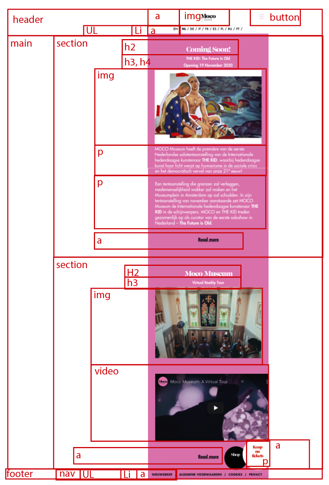
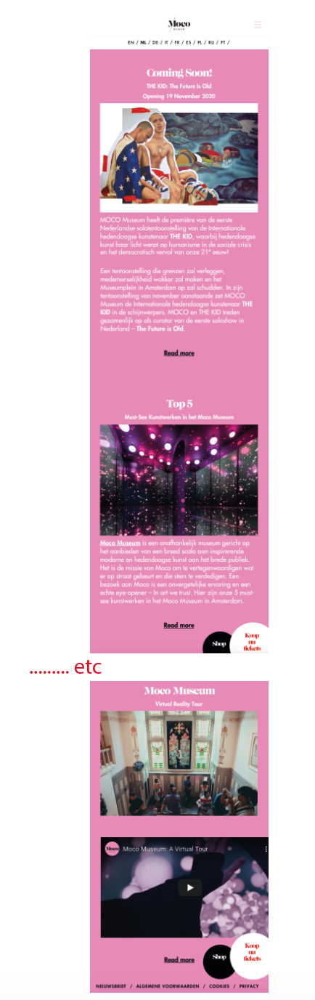
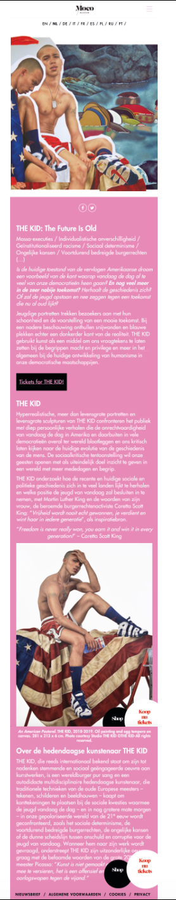
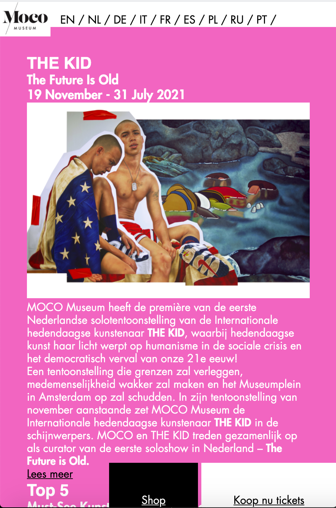
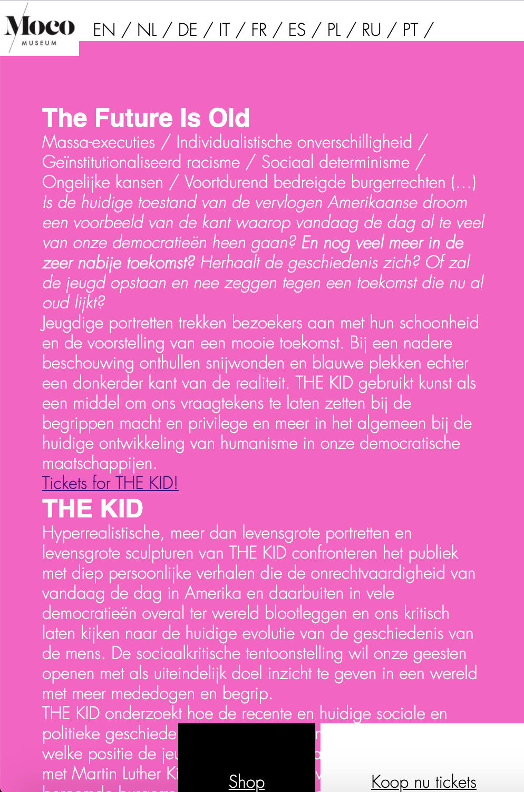
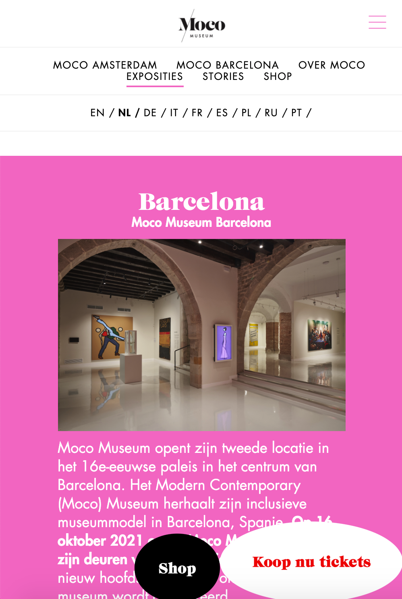
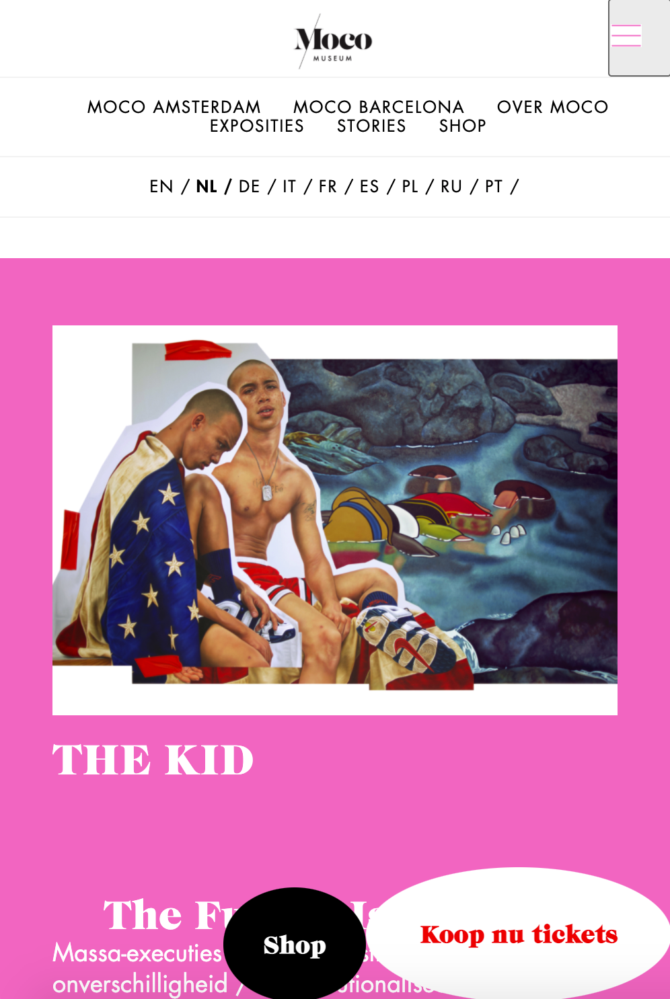

# Procesverslag
Markdown is een simpele manier om HTML te schrijven.  
Markdown cheat cheet: [Hulp bij het schrijven van Markdown](https://github.com/adam-p/markdown-here/wiki/Markdown-Cheatsheet).

Nb. De standaardstructuur en de spartaanse opmaak van de README.md zijn helemaal prima. Het gaat om de inhoud van je procesverslag. Besteedt de tijd voor pracht en praal aan je website.

Nb. Door *open* toe te voegen aan een *details* element kun je deze standaard open zetten. Fijn om dat steeds voor de relevante stuk(ken) te doen.

**Auteur:** Marjolein de Smit
https://marjoleindesmit.github.io/blokweb/

## Bronnenlijst
1. https://fontsgeek.com/fonts/CaslonGraphiqueEF-Regular
2. https://css-tricks.com/snippets/css/using-font-face/
3. https://stackoverflow.com/questions/1734618/how-to-increase-the-gap-between-text-and-underlining-in-css
4. https://css-tricks.com/snippets/css/a-guide-to-flexbox/
5. https://www.youtube.com/watch?v=dIyVTjJAkLw (hamburger menu)
6. https://dev.to/ljcdev/easy-hamburger-menu-with-js-2do0

## Breakdownschets (week 1)

-uitwerken voor de 1e werkgroep - eind van de eerste week-

## Intake (week 1)
-uitwerken voor de kick-off werkgroep - begin van de eerste week-

**Je startniveau:** Blauw

**Je focus:** Responsive

**Je opdracht:** mocomuseum.nl

**Screenshot(s) van de eerste pagina (small screen):**

**Screenshot(s) van de tweede pagina (small screen):**

## Voortgang 1 (week 1)

### Stand van zaken

dit ging goed: html structuur opmaken, basis css

dit was lastig: het maken van de header met css

**Screenshot(s):

-screenshot(s) van hoe ver je bent met korte uitleg-
Ik heb nu voor beide webpagina's de html-opmaak zo goed als af, en ben begonnen aan het vormgeven in CSS. Het scheelt dat ik vorig jaar al een begin had gemaakt aan de code.

## Voortgang 2 (week 2)

dit ging goed: flexbox gebruiken om elementen te centreren.

dit was lastig: de juiste font family laten werken in css, omdat ik deze via een zip bestandje moest downloaden. ik moest hiervoor @font-face gebruiken. Ook vond ik het hamburger menu lastig, ik heb tot nu toe alleen nog de animatie van het icoontje. Maar door veel op te zoeken en hulp te vragen aan mensen die goed kunnen coderen ben ik er uit gekomen. Nu moet ik er nog voor zorgen dat er een overlay komt wanneer het hamburgermenu aangeklikt is.

**Screenshot(s):**
-screenshot(s) van hoe ver je bent met korte uitleg-
Ik ben nog wat verder gekomen met de html op maak, hier mis ik alleen nog een paar kleine details. Ook ben ik een stuk verder gekomen met mijn CSS.

## Voortgang 3 (week 3)

Ontvangen feedback tijdens feedbackgesprek:

dit ging goed:

dit was lastig:

Screenshots:

-screenshot(s) van hoe ver je bent met korte uitleg-

### Agenda voor meeting

-samen met je groepje opstellen-

| student 1      | student 2          | student 3    | student 4        |
| ---            | ---                | ---          | ---              |
| dit bespreken  | en dit             | en ik dit    | en dan ik dat    |
| an dat ook nog | dit als er tijd is | nog een punt | dit wil ik zeker |
| ...            | ...                | ...          | ...              |

### Verslag van meeting

-na afloop snel uitkomsten vastleggen-

## Voortgang 2 (week 2)

dit ging goed: 

dit was lastig: 

**Screenshot(s):**
-screenshot(s) van hoe ver je bent met korte uitleg-

## Toegankelijkheidstest (week 4)

uitwerken na test in 8e voortgang

### Bevindingen
Lijst met je bevindingen die in de test naar voren kwamen:

#### Titel eerste bevinding
Hier korte omschrijving (met indien nodig een afbeelding)

Hier een omschrijving van hoe het opgelost kan worden (met indien nodig een afbeelding)

#### Titel tweede bevinding. 
Hier korte omschrijving (met indien nodig een afbeelding)

Hier een omschrijving van hoe het opgelost kan worden (met indien nodig een afbeelding)

#### Titel volgende bevinding. 
Hier korte omschrijving (met indien nodig een afbeelding)

Hier een omschrijving van hoe het opgelost kan worden (met indien nodig een afbeelding)

#### Titel nog een bevinding. 
Hier korte omschrijving (met indien nodig een afbeelding)

Hier een omschrijving van hoe het opgelost kan worden (met indien nodig een afbeelding)

## Voortgang 3 (week 6)

dit ging goed:
dit was lastig:

**Screenshot(s):**
-screenshot(s) van hoe ver je bent met korte uitleg-

## Eindgesprek (week 7/8)

-dit ging goed & dit was lastig-

**Screenshot(s):**

-screenshot(s) van je eindresultaat-

