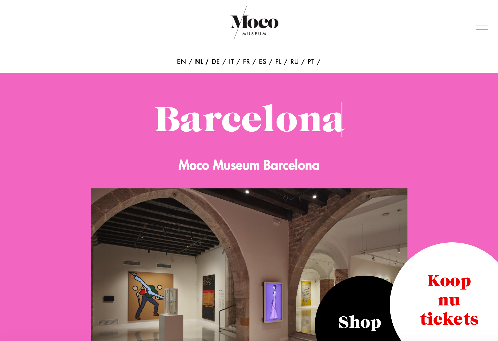
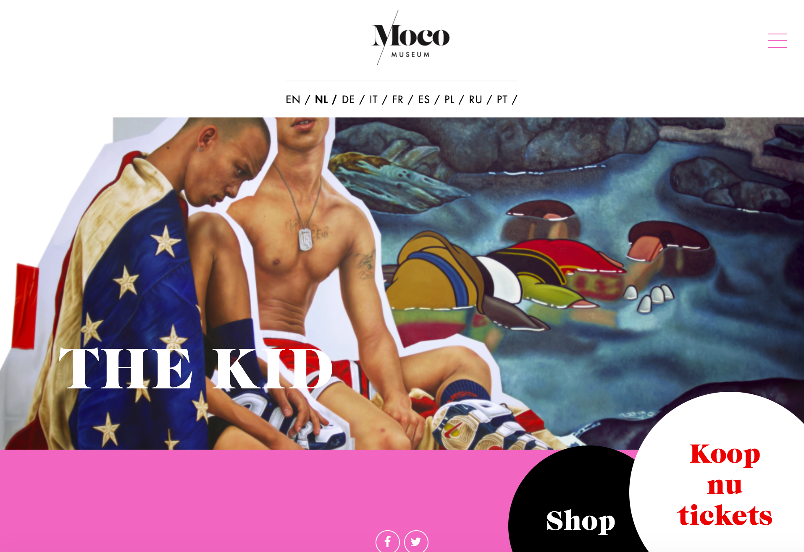
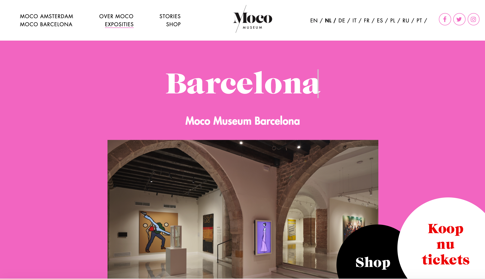
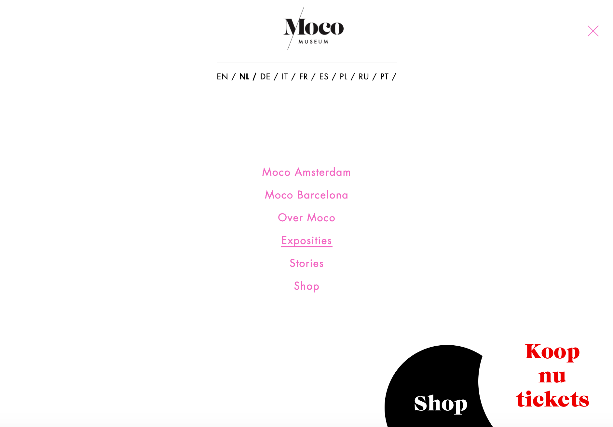

# Procesverslag
Markdown is een simpele manier om HTML te schrijven.  
Markdown cheat cheet: [Hulp bij het schrijven van Markdown](https://github.com/adam-p/markdown-here/wiki/Markdown-Cheatsheet).

Nb. De standaardstructuur en de spartaanse opmaak van de README.md zijn helemaal prima. Het gaat om de inhoud van je procesverslag. Besteedt de tijd voor pracht en praal aan je website.

Nb. Door *open* toe te voegen aan een *details* element kun je deze standaard open zetten. Fijn om dat steeds voor de relevante stuk(ken) te doen.

**Auteur:** Marjolein de Smit
https://marjoleindesmit.github.io/blokweb/

## Bronnenlijst
Deze bronnen heb ik gebruikt tijdens het coderen van mijn website.

1. https://fontsgeek.com/fonts/CaslonGraphiqueEF-Regular
2. https://css-tricks.com/snippets/css/using-font-face/
3. https://stackoverflow.com/questions/1734618/how-to-increase-the-gap-between-text-and-underlining-in-css
4. https://css-tricks.com/snippets/css/a-guide-to-flexbox/
5. https://www.youtube.com/watch?v=dIyVTjJAkLw (hamburger menu)
6. https://dev.to/ljcdev/easy-hamburger-menu-with-js-2do0
7. https://fontawesome.com/v4.7/icon/facebook en https://fontawesome.com/v4.7/icon/twitter en https://fontawesome.com/v4.7/icon/instagram voor social media icoontjes
8. https://css-tricks.com/a-complete-guide-to-css-media-queries/
9. https://developer.mozilla.org/en-US/docs/Web/CSS/object-fit?retiredLocale=nl
10. https://www.javascripttutorial.net/dom/css/check-if-an-element-contains-a-class/
11. https://www.codegrepper.com/code-examples/css/css+hover+change+color+of+another+element

## Breakdownschets (week 1)

-uitwerken voor de 1e werkgroep - eind van de eerste week-

## Intake (week 1)
-uitwerken voor de kick-off werkgroep - begin van de eerste week-

**Je startniveau:** Blauw

**Je focus:** Responsive

**Je opdracht:** mocomuseum.nl

**Screenshot(s) van de eerste pagina (small screen):**

**Screenshot(s) van de tweede pagina (small screen):**

## Voortgang 1 (15 nov - 21 nov)

### Stand van zaken

dit ging goed: html structuur opmaken, basis css

dit was lastig: het maken van de header met css

**Screenshot(s):

-screenshot(s) van hoe ver je bent met korte uitleg-
Ik heb nu voor beide webpagina's de html-opmaak zo goed als af, en ben begonnen aan het vormgeven in CSS. Het scheelt dat ik vorig jaar al een begin had gemaakt aan de code.

## Voortgang 2 (22 nov - 5 dec)

dit ging goed: flexbox gebruiken om elementen te centreren.

dit was lastig: de juiste font family laten werken in css, omdat ik deze via een zip bestandje moest downloaden. ik moest hiervoor @font-face gebruiken. Ook vond ik het hamburger menu lastig, ik heb tot nu toe alleen nog de animatie van het icoontje. Maar door veel op te zoeken en hulp te vragen aan mensen die goed kunnen coderen ben ik er uit gekomen. Nu moet ik er nog voor zorgen dat er een overlay komt wanneer het hamburgermenu aangeklikt is.

**Screenshot(s):**
-screenshot(s) van hoe ver je bent met korte uitleg-
Ik ben nog wat verder gekomen met de html op maak, hier mis ik alleen nog een paar kleine details. Ook ben ik een stuk verder gekomen met mijn CSS.

## Voortgang 3 (6 dec - 12 dec)

Ontvangen feedback tijdens feedbackgesprek:
Ik heb feedback ontvangen over de dingen waar ik vragen over had, zoals het vormgeven van de buttons rechtsonder, welke eenheden ik het beste kan gebruiken, waar ik mediaqueries moet gaan gebruiken, en een aantal algemene tips. Ik kan bijvoorbeeld beter min-width gebruiken, ik heb nu steeds max-width gebruikt. Verder was ik 'al goed op weg', dus dat was fijn om te horen.

dit ging goed: een probleem wat ik had met flexbox op te lossen, na feedback van de docent 
dit was lastig: vormgeven van de buttons rechtsonder

## Voortgang 4 (13 dec - 19 dec)

Ik ben er deze week niet aan toe gekomen om verder te werken aan mijn code.

## Voortgang 5 (20 dec - 24 dec + kerstvakantie)

dit ging goed: werken met mediaqueries om de teksten en foto's responsive te maken, een overlaymenu maken in CSS, 
dit was lastig: verder gaan met JavaScript, vormgeving van iframe element, responsive maken van specifiek de header

**Screenshot(s):**
-screenshot(s) van hoe ver je bent met korte uitleg-
Ik moet nu vooral de laatste details nog doen: bijv. een laatste beetje javascripts zodat de interactie met het hamburger menu werkt en alles responsive laten werken

## Voortgang 6 (10 jan - 16 jan) (Eindgesprek)

dit ging goed: hover animaties (op de social media iconen en de knoppen rechtsonder, etc.) 
dit was lastig: ik liep best een tijdje vast met hoe ik er met javascript voor kon zorgen dat de overlay tevoorschijn kwam als het hamburger menu aangeklikt werd. Ook vond ik het lastig om te zorgen dat het logo op groot scherm (waar het hamburger menu verschijnt) nog steeds in het midden stond. Dit heb ik uiteindelijk op kunnen lossen met flex-grow. 

Ik heb mijn best gedaan om de website zo goed mogelijk responsive te maken. Om dat te doen heb ik af en toe iets aangepast aan het originele ontwerp van MOCO, door bijvoorbeeld op groot scherm het hoofdmenu 2 rijen onder elkaar de ruimte te geven zodat het niet in de weg ging voor het logo (zoals soms op hun officiele website gebeurt). Ook heb ik ervoor gekozen om het taalkeuzemenu bij het één-na-grootste scherm nog onder het logo te laten i.p.v. ernaast, omdat door deze naast het logo te plaatsen er op de originele site ook problemen ontstaan met het in de weg zitten van het logo.
Ook heb ik wat dingen qua groottes / afmetingen / witruimte anders vormgegeven, omdat ik sommige dingen op de officiele website bijv. te dicht bij elkaar vond staan.

**Screenshot(s):**
-screenshot(s) van het eindresultaat 

