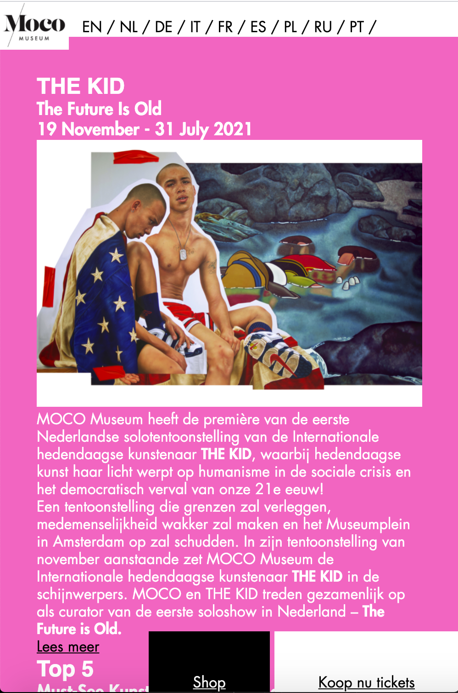
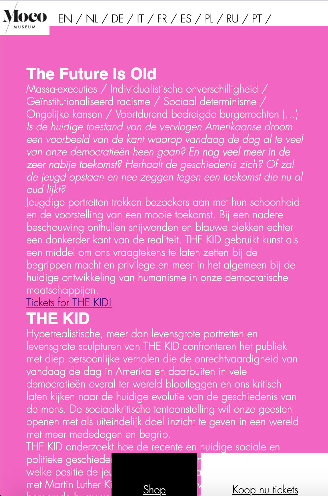
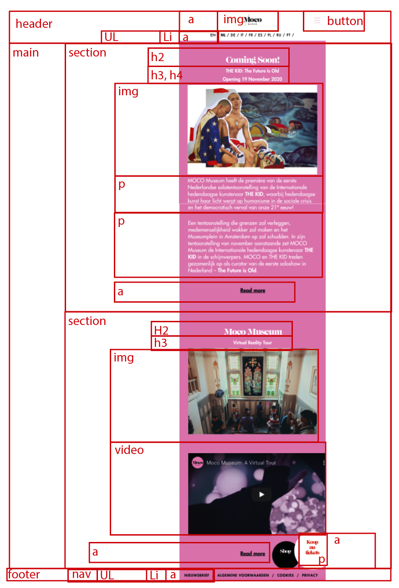
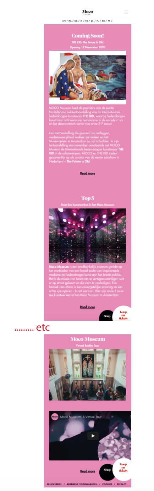
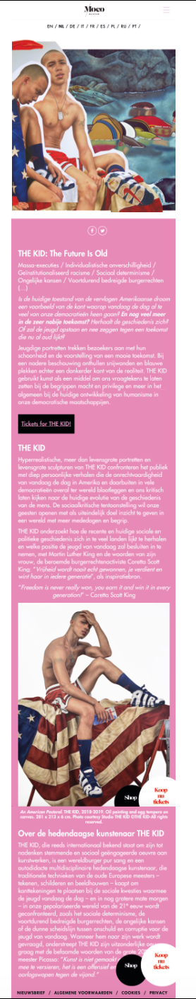

# Procesverslag
**Auteur:** Marjolein de Smit
https://marjoleindesmit.github.io/blokweb/

Markdown cheat cheet: [Hulp bij het schrijven van Markdown](https://github.com/adam-p/markdown-here/wiki/Markdown-Cheatsheet). Nb. de standaardstructuur en de spartaanse opmaak zijn helemaal prima. Het gaat om de inhoud van je procesverslag. Besteedt de tijd voor pracht en praal aan je website.

## Bronnenlijst
1. -bron 1-
2. -bron 2-
3. -...-

## Eindgesprek (week 7/8)

-dit ging goed & dit was lastig-

**Screenshot(s):**

-screenshot(s) van je eindresultaat-

## Voortgang 3 (week 6)

dit ging goed: 

dit was lastig: 

**Screenshot(s):**
-screenshot(s) van hoe ver je bent met korte uitleg-

## Voortgang 2 (week 5)

dit ging goed:
dit was lastig:

**Screenshot(s):**
-screenshot(s) van hoe ver je bent met korte uitleg-

## Voortgang 1 (week 3)

### Stand van zaken

dit ging goed: html structuur opmaken, basis css

dit was lastig: het maken van de header met css

**Screenshot(s):

-screenshot(s) van hoe ver je bent met korte uitleg-
Ik heb nu voor beide webpagina's de html-opmaak zo goed als af, en ben begonnen aan het vormgeven in CSS. 

### Agenda voor meeting

-samen met je groepje opstellen-

| student 1      | student 2          | student 3    | student 4        |
| ---            | ---                | ---          | ---              |
| dit bespreken  | en dit             | en ik dit    | en dan ik dat    |
| an dat ook nog | dit als er tijd is | nog een punt | dit wil ik zeker |
| ...            | ...                | ...          | ...              |

### Verslag van meeting

-na afloop snel uitkomsten vastleggen-

## Breakdownschets (week 1)

-uitwerken voor de 1e werkgroep - eind van de eerste week-

## Intake (week 1)
-uitwerken voor de kick-off werkgroep - begin van de eerste week-

**Je startniveau:** Blauw

**Je focus:** Responsive

**Je opdracht:** mocomuseum.nl

**Screenshot(s) van de eerste pagina (small screen):**

**Screenshot(s) van de tweede pagina (small screen):**

